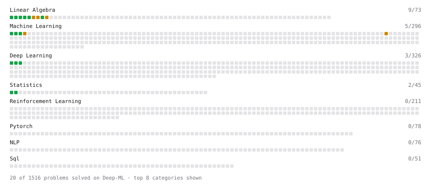

# Deep-ML

My machine learning practice from [Deep-ML](https://www.deep-ml.com). Every solution here was written by hand.

**4** solved · 4 problems · 0 labs · 0 math

[**Browse the interactive portfolio**](https://millanp95.github.io/deep-ml/) to replay this filling in over time.

## Problems

| | Difficulty | Solved | |
| --- | --- | --- | --- |
| [Feature Scaling Implementation](https://www.deep-ml.com/problems/16) | easy | 2025-02-06 | [solution](problems/0016-feature-scaling-implementation) |
| [Linear Regression Using Normal Equation](https://www.deep-ml.com/problems/14) | easy | 2025-02-06 | [solution](problems/0014-linear-regression-using-normal-equation) |
| [Matrix-Vector Dot Product](https://www.deep-ml.com/problems/1) | easy | 2025-02-04 | [solution](problems/0001-matrix-vector-dot-product) |
| [Transpose of a Matrix](https://www.deep-ml.com/problems/2) | easy | 2025-02-05 | [solution](problems/0002-transpose-of-a-matrix) |

---

_This file is regenerated by Deep-ML on every push._
